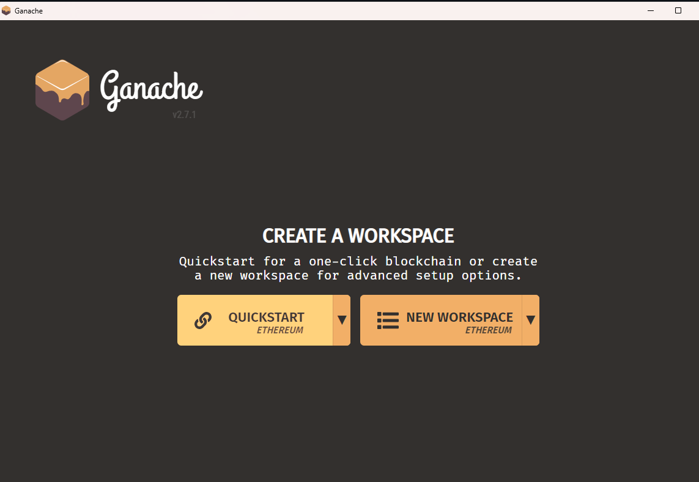
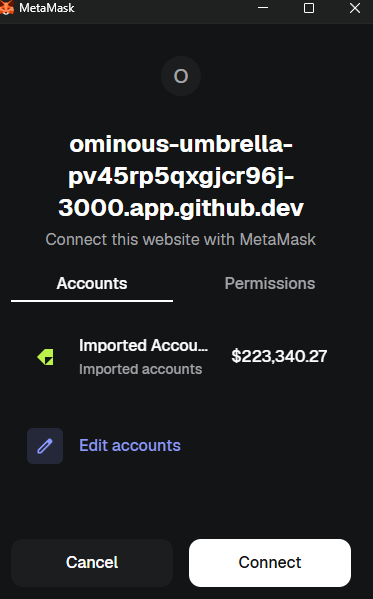

1 Ensure you have the following installed on your machine
Node.js
MetaMask (browser extension)
Ganache Desktop Application (for local testing)
GIT


2 Project Installation

step 1
on the terminal type
npm install


step 2
on the terminal type
cd client
npm install
This step will automatically download React, Next.js, TailwindCSS, and all other UI libraries required for the project


step 3 Environment Variable Setup
You need to configure the environment variables so the frontend knows where the smart contract is.

1. In the root directory, locate the `.env.example` file.
2. Duplicate it and rename it to `.env`. **(⚠️ WARNING: NEVER commit your real `.env` file containing private keys to GitHub!)**
3. Inside `.env`, provide your Ganache URL and a private key provided by Ganache.
on the terminal type
    ```env
    GANACHE_URL=http://127.0.0.1:7545
    GANACHE_KEY=0x<paste_one_private_key_from_ganache_here>
    ```

    step 4 Start the Local Blockchain
1. Open the **Ganache** desktop application.
2. Click **Quickstart** (Ethereum).

3. The server will start running on port `7545` by default, giving you 10 fake accounts 


step 5 Deploy the Smart Contract
Keep Ganache running, open a new terminal in the root directory, and deploy the smart contract to your local Ganache blockchain:

on the terminal type
```bash
node node_modules/hardhat/internal/cli/cli.js run scripts/deployBookRatings.js --network ganache
```

step 6 Create a file named `.env.local` inside the `/client` directory and paste the contract address you just generated:

```env
# /client/.env.local
NEXT_PUBLIC_CONTRACT_ADDRESS=0x<YOUR_COPIED_ADDRESS_HERE>
NEXT_PUBLIC_ALCHEMY_URL=http://127.0.0.1:7545
```


step 7 In your terminal, navigate to the `client` folder and start the Next.js development server:

```bash
cd client
npm run dev
```

step 8 
Testing the Application
1. Open `http://localhost:3000` in your web browser.
2. Set your MetaMask network to **Ganache Local** (RPC: `http://127.0.0.1:7545`, Chain ID: `1337`).
3. Import one of your Ganache test accounts into MetaMask using its Private Key.
4. Click **Connect Wallet** on the DApp.

5. You can now use your fake ETH to interact with the Book Ratings smart contract completely for free!
